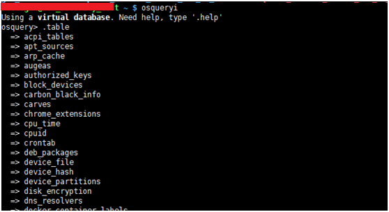
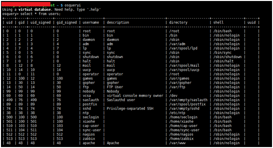
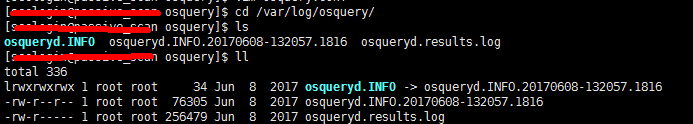
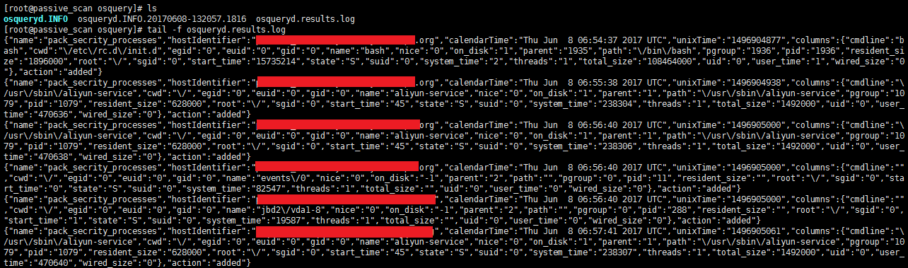

# HIDS 0.1

HIDS运行依赖这样一个原理：一个成功的入侵者一般而言都会留下他们入侵的痕迹。本人更倾向于通过记录主机的重要信息变更来发现入侵者。
本项目由两部分组成：一部分osquery、另一部分监控脚本来补充osquery规则的不足；
本文是第一部分osquery规则部分，实现部分主机信息监控。

## Author ##

咚咚呛 

如有其他建议，可联系微信280495355

## Support ##

满足如下安全需求

	1、支持大部分Centos6-7、winodws系统等。
	2、可记录主机的信息变更情况，如账户、进程、网络连接等等；
	3、变更结果记录到日志中；
	

技术细节如下：

	1、监控主机信息如下：
	1）对公网访问的网络连接增加情况
	2）进程增加情况
	3）对外端口侦听增加情况
	4）arp缓存变化情况
	5）authorized_keys公钥差异变化
	6）crontab定时任务差异变化
	7）DNS映射表差异变化
	8）etc_hosts信息差异变化
	9）etc_services 差异变化
	10）groups 本地系统组差异变化
	11）iptables 防火墙差异变化
	12）系统登录和登出差异变化
	13）主机系统的主动路由表差异变化
	14）应用程序和二进制文件设置为用户/登录启动项,差异变化
	15）通过sudo作为其他用户运行命令的规则差异变化
	16）主动插入主机系统的USB设备差异变化
	17）本地系统用户组关系差异变化
	18）系统用户差异变化

## Test Environment ##

>centos 7、6

## Tree ##

	osquery
	----osquery.conf		   	   #osquery系统配置文件
	----secrity.conf		   	   #安全监控规则

## Deploy ##
	
	1）根据系统同版本，下载osquery
	$ wget https://s3.amazonaws.com/osquery-packages/centos7/x86_64/osquery-2.4.6-1.linux.x86_64.rpm 
	$ wget https://s3.amazonaws.com/osquery-packages/centos6/x86_64/osquery-2.4.6-1.linux.x86_64.rpm
	2）根据系统版本，安装osquery
	$ sudo rpm -ivh centos6_osquery-2.4.6-1.linux.x86_64.rpm
	$ sudo rpm -ivh centos7_osquery-2.4.6-1.linux.x86_64.rpm
	3）拷贝 osquery.conf 和 secrity.conf 到 /etc/osquery/目录下
	4）启动osquery服务
	$ sudo /etc/init.d/osqueryd restart

## Config ##

	安全监控规则在文件secrity.conf中，可自行修改，其中包含主要几项，query、interval、removed。
	query: 查询的SQL语句
	interval: 查询间隔，单位时间为秒
	removed: 是否生成减少的记录
	如：
	"users": {
      "query" : "select * from users;",
      "interval" : 3600,
	  "removed": false
    }
	

## Log ##

默认日志结果存储在/var/log/osquer/osqueryd.INFO，其中保存了主机差异变化信息

## Screenshot ##

安装完毕后，如下：

服务器启动后如下：

